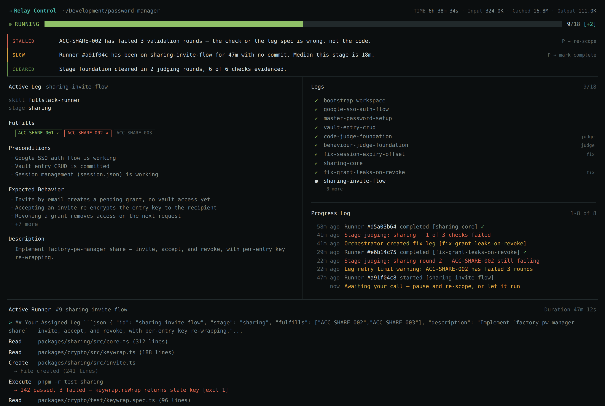

# Relay

A Claude Code skill for running a long-horizon build as a supervised relay: write
the acceptance contract before any code, break the work into legs, run one leg at
a time with a fresh agent each time, and gate every stage behind adversarial
judges until every check passes.

The problem it solves is not that models write bad code. It is that a human
cannot supervise a twelve-hour build by reading every diff. Relay is a structure
that makes long autonomous runs legible: you approve a plan once, then watch a
dashboard that tells you the one thing you need to know — whether to intervene.



## Three invariants

Everything else in the skill is machinery for these.

**Contract before code.** What counts as correct is written before an
implementation exists to bias it. Tests written afterward confirm decisions; they
do not catch bugs.

**One runner on the track. Readers fan out.** Anything that mutates state runs
strictly serially. Anything read-only — search, research, review — runs in
parallel. Concurrency is a property of the operation, not the schedule.

**The baton carries state, not the conversation.** Every leg gets a fresh agent
that reads state from disk and writes results back. No trajectory is carried
forward, so there is none for attention to degrade across. The fortieth leg is
built as carefully as the first.

## Install

```bash
git clone https://github.com/Ammar478/relay ~/.claude/skills/relay
```

Update with `git pull` in that directory. Verify with `/skills` inside Claude
Code — you should see `relay` listed.

## Use

```
/relay Build a shared-expense splitter. Add people to a group, log expenses with
a payer and a split rule, then settle up with a minimal set of transactions.
Web UI plus a JSON API. Node 22, zero dependencies.
```

It asks a batch of scoping questions, researches, writes the contract, plans the
legs — then **stops at an approval gate**. Nothing executes until you say go.

After that you supervise rather than co-write. Open `.relay/control.html` in a
browser and refresh it as the run progresses:

```bash
python3 ~/.claude/skills/relay/scripts/render_dashboard.py --relay-dir .relay
open .relay/control.html
```

To steer mid-run, talk to the coach in plain language — *"the runner on invites
has been stuck twenty minutes, mark it done and move on"*, or *"pause, the schema
changed"*. There are no buttons.

## Vocabulary

| Term | Meaning |
|---|---|
| **relay** | The whole run, from objective to shipped |
| **leg** | One bounded unit of work, finishable by one fresh agent in one context |
| **stage** | A group of legs worth judging together; *cleared* once all its checks pass |
| **check** | One testable behavioural claim, ID `ACC-<AREA>-<NNN>` |
| **coach** | Plans, hands out legs, disposes of batons, holds the gates |
| **runner** | A fresh agent that runs exactly one leg |
| **judge** | A fresh agent that verifies, having never seen the code written |
| **baton** | The structured handoff a runner writes when its leg ends |

## How a run goes

| Phase | What happens |
|---|---|
| 0 · Scope | One batch of questions, then parallel read-only research agents |
| 1 · Contract | Testable behavioural checks with stable IDs and named evidence |
| 2 · Plan | Legs grouped into stages; every check claimed by exactly one leg |
| 3 · Approve | **The run stops here.** Nothing executes without an explicit go |
| 4 · Run | Fresh runner per leg: tests first, implement, verify, commit, write a baton |
| 5 · Judge | Code judge and behaviour judge, in parallel, with no implementation history |
| 6 · Fix | Failures become fix legs at the head of the queue. Repeat until clear |
| 7 · Finish | Checks passed, rounds per stage, accepted debt, what to look at first |

Judge legs sit **in the queue** like any other leg, so judging shows up in the
plan, the dashboard, and the run count instead of hiding in a gate.

## Things worth knowing before your first run

**Judging will not pass first time.** Expect two to four rounds per stage and
roughly a third of your legs to be fixes. That is the architecture working. If a
run goes all-green on the first pass, be suspicious of the contract rather than
pleased with the code.

**It costs real tokens.** Most of that is the judging, which is the part worth
paying for. Start with one small stage before committing to a long run.

**The contract is the thing to get right.** Every hour of rework traces back to
an ambiguous check. That is the phase to over-invest in.

**Legs and checks grow apart.** Checks are acceptance criteria fixed at planning
time; legs are units of work that multiply as judges find problems. A relay
showing 5 of 27 legs done with 0 checks passed is normal before the first gate —
legs-done measures motion, checks-passed measures progress.

## The dashboard is deliberately forgiving

`render_dashboard.py` reads `legs.json` and `state.json`, and takes anything
those cannot hold from an optional `dashboard.json`. Every input is treated as
untrusted: leg statuses are normalised (`done`, `in progress`, `TODO` all map
onto the four states the view knows), attention signals may be objects or plain
strings, runner rows fall back to being derived from the batons on disk, and any
panel that throws is skipped rather than blanking the page.

This is not defensive programming for its own sake. The coach is a language model
writing JSON, and it will not use your exact vocabulary every time. A dashboard
that renders `undefined` the first time a field is named differently is worse
than no dashboard, because it makes real progress look like broken tooling.

## Layout

```
SKILL.md                    the loop the coach follows
references/
  research.md               deep-search loop and gap analysis
  execution.md              runner briefings, batons, recovery plays
  validation.md             writing checks that hold up, and the two judges
  dashboard.md              Relay Control: when to render, what to write
templates/                  relay.md contract.md legs.json state.json baton.md
assets/control.html         dashboard template
scripts/render_dashboard.py fills the template from .relay/ state
```

## Origin

The architecture comes from Luke Alvoeiro's talk *The Multi-Agent Architecture
That Actually Ships* (AI Engineer, 2026) and Factory's published writing on
Missions. Relay is an independent implementation of those ideas for Claude Code,
with its own vocabulary — it is not affiliated with Factory and does not reuse
their code.

Two additions that are not from the talk: the **attention band** at the top of
the dashboard, which derives stalled and blocked signals from state so a
supervisor sees the one thing that needs them; and the **Contract view**, which
is the honest counterweight to a progress bar.

Worth reading alongside it: Cognition's [Don't Build
Multi-Agents](https://cognition.com/blog/dont-build-multi-agents), which argues
the opposite case.

## Licence

MIT — see [LICENSE](LICENSE).
