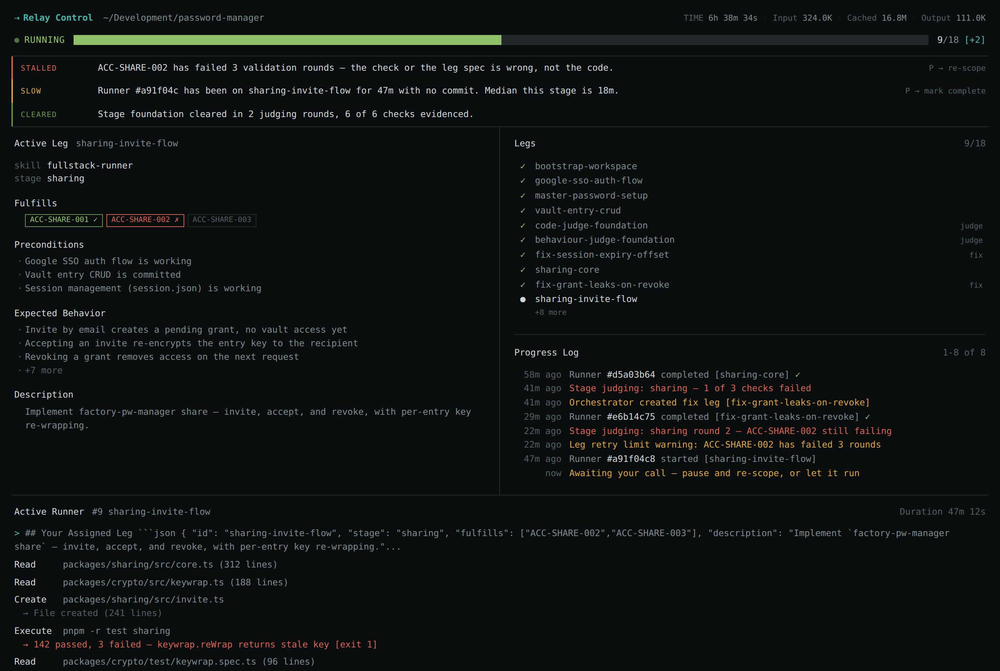

# Relay

A skill for running a long-horizon build as a supervised relay: write the
architecture and the acceptance contract before any code, declare how the
product starts, break the work into legs, run every leg with a fresh agent and
fan out where their files *and resources* are disjoint, and gate every stage
behind adversarial judges until every check passes.

It behaves like a Factory Mission — plan first, features (legs) grouped into
milestones (stages), two validators per milestone, a human supervising as a
project manager — but it is harness-portable: the same skill runs on Factory,
Claude Code, Codex CLI and Cursor, because it names capabilities, not vendor
tool names, and establishes at kickoff what the harness it is in can do.

The problem it solves is not that models write bad code. It is that a human
cannot supervise a twelve-hour build by reading every diff. Relay is a structure
that makes long autonomous runs legible: you approve a plan once, then watch a
dashboard that tells you the one thing you need to know — whether to intervene.



## Three invariants

Everything else in the skill is machinery for these.

**Contract before code.** What counts as correct is written before an
implementation exists to bias it. Tests written afterward confirm decisions;
they do not catch bugs. The contract is derived from an authoritative
`architecture.md`, so runners are told the design instead of re-deriving it.

**One runner on the track — the track being the files *and* the resources.**
The serial rule exists to stop two runners making conflicting architectural
choices, so it binds only legs that share files. Legs whose file sets are
disjoint run in parallel from the first leg on, under a declared concurrency
ceiling with per-leg isolation contexts — because disjoint files do not stop
two legs colliding on a port and a database — and read-only work always fans
out.

**The handoff carries state, not the conversation.** Every leg gets a fresh
agent that reads state from disk and writes results back. No trajectory is
carried forward, so there is none for attention to degrade across. The fortieth
leg is built as carefully as the first. Handoffs are structured JSON, validated
at the moment they are written.

## Install

Clone wherever your harness loads skills from:

```bash
# Factory
git clone https://github.com/Ammar478/relay ~/.factory/skills/relay
# Claude Code
git clone https://github.com/Ammar478/relay ~/.claude/skills/relay
```

On Codex CLI or Cursor there is no skill loader: keep the clone anywhere and
point the agent at `SKILL.md` in your prompt or rules file. Run the capability
pre-flight (`references/harness.md`) in your first session — it establishes what
this harness calls a subagent, whether it can run legs in parallel, and which
conventions file it reads.

## Use

```
/relay Build a shared-expense splitter. Add people to a group, log expenses with
a payer and a split rule, then settle up with a minimal set of transactions.
Web UI plus a JSON API. Node 22, zero dependencies.
```

It runs a capability pre-flight and an environment readiness check, asks a batch
of scoping questions, researches, writes the architecture and the contract,
plans the legs — then **stops at an approval gate**, with a run-count estimate.
Nothing executes until you say go.

After that you supervise rather than co-write.

## Watching a run

**Relay Control** is a terminal dashboard over the live `.relay/` directory. Run
it from anywhere — it opens the relay it finds from the working directory:

```bash
<path-to-the-clone>/relay-control
```

Name a relay to watch another project's run, either the relay directory or the
project above it:

```bash
<path-to-the-clone>/relay-control ~/work/some-project
```

Inside a session, `/relay-control` prints a snapshot of the relay into the
conversation — phase, leg and check counts, the active leg, the attention items
— plus that shell line. A slash command gets no TTY, so on macOS it opens the
live view in a new Terminal window via `osascript` and prints the still snapshot
alongside it; otherwise it reports the shell line so you can open the live view
yourself.

There is also a static HTML dashboard, for a snapshot you can keep or share:

```bash
python3 <path-to-the-clone>/scripts/render_dashboard.py --relay-dir .relay
open .relay/control.html
```

To steer mid-run, talk to the coach in plain language — *"the runner on invites
has been stuck twenty minutes, mark it done and move on"*, or *"pause, the
schema changed"*. There are no buttons. Pausing is state on disk: a resumed
relay knows what happened.

## Vocabulary

| Term | Meaning |
|---|---|
| **relay** | The whole run, from objective to shipped |
| **leg** | One bounded unit of work, finishable by one fresh agent in one context |
| **stage** | A group of legs worth judging together; *cleared* once all its checks pass |
| **check** | One testable claim, ID `ACC-<AREA>-<NNN>` — behavioural unless marked `Convention`, with a named tool and evidence |
| **coach** | Plans, hands out legs, disposes of handoff items, holds the gates |
| **runner** | A fresh agent that runs exactly one leg |
| **judge** | A fresh agent that verifies, having never seen the code written |
| **handoff** (baton) | The structured JSON a runner writes when its leg ends |

## How a run goes

| Phase | What happens |
|---|---|
| 0 · Scope | Capability pre-flight; environment readiness; one batch of questions; parallel read-only research agents |
| 1 · Architecture + contract | An authoritative design, then testable behavioural checks with stable IDs, named tools and named evidence |
| 2 · Plan | Legs grouped into stages; every check claimed by exactly one leg; a concurrency ceiling |
| 3 · Approve | **The run stops here.** Nothing executes without an explicit go — and the run count is on the table |
| 4 · Run | Fresh runner per leg, disjoint legs in parallel under the ceiling: tests first, implement, verify, commit, write and validate a JSON handoff |
| 5 · Judge | Code judge and behaviour judge, in parallel, sharded when the stage is big, with no implementation history |
| 6 · Fix | Failures become fix legs at the head of the queue; what the round taught goes in the library. Repeat until clear |
| 7 · Finish | Checks passed, rounds per stage, accepted debt, what to look at first |

Judge legs sit **in the queue** like any other leg, so judging shows up in the
plan, the dashboard, and the run count instead of hiding in a gate.

## Things worth knowing before your first run

**Judging will not pass first time.** Expect two to four rounds per stage and
roughly a third of your legs to be fixes. That is the architecture working. If a
run goes all-green on the first pass, be suspicious of the contract rather than
pleased with the code.

**It costs real tokens.** Most of that is the judging, which is the part worth
paying for. The Phase 3 gate shows the run count before you approve. Start with
one small stage before committing to a long run.

**The contract is the thing to get right.** Every hour of rework traces back to
an ambiguous check. That is the phase to over-invest in — and the architecture
before it, since the contract is derived from that.

**Legs and checks grow apart.** Checks are acceptance criteria fixed at planning
time; legs are units of work that multiply as judges find problems. A relay
showing 5 of 27 legs done with 0 checks passed is normal before the first gate —
legs-done measures motion, checks-passed measures progress.

## The dashboard is deliberately forgiving

`render_dashboard.py` reads `legs.json` and `state.json`, and takes anything
those cannot hold from an optional `dashboard.json`. Every input is treated as
untrusted: leg statuses are normalised (`done`, `in progress`, `TODO` all map
onto the four states the view knows), attention signals may be objects or plain
strings, runner rows fall back to being derived from the handoffs on disk, and
any panel that throws is skipped rather than blanking the page.

This is not defensive programming for its own sake. The coach is a language model
writing JSON, and it will not use your exact vocabulary every time. A dashboard
that renders `undefined` the first time a field is named differently is worse
than no dashboard, because it makes real progress look like broken tooling.
The JSON handoff is the counterweight: `scripts/relay_handoff.py validate`
refuses a malformed one at the moment it is written, where the prose baton it
replaced failed silently at the gate.

## Layout

```
SKILL.md                    the loop the coach follows
references/
  harness.md                the capability pre-flight; what each harness calls things
  environment.md            services.yaml, init.sh, drivers, isolation, the ceiling
  research.md               deep-search loop and gap analysis
  execution.md              briefings, handoffs, parallel runners, recovery plays
  validation.md             writing checks that hold up, and the two judges
  dashboard.md              Relay Control: when to render, what to write
  squad.md                  the seats, and why they do not message each other
  governance.md             review ownership, the merge gate, environments
  advisors.md               optional second opinions, and what they may never do
templates/                  relay.md architecture.md contract.md legs.json state.json
                            services.yaml init.sh handoff.json baton.md (legacy)
.factory/droids/            one agent definition per squad seat (Factory format;
                            read them as seat briefings on any other harness)
assets/control.html         dashboard template
scripts/render_dashboard.py fills the template from .relay/ state
relay-control               opens the live terminal dashboard
scripts/relay_model.py      the one reader of .relay/; everything else asks it
scripts/relay_decide.py     dispatch, coverage, budget, items — computed, not reasoned
scripts/relay_handoff.py    the JSON handoff: validate, items, summary, new
scripts/relay_log.py        the typed event log: append, tail
scripts/relay_services.py   bring the declared stack up and wait on real healthchecks
scripts/relay_control/      the terminal dashboard itself
skills/relay-control/       the /relay-control skill
```

## Origin

The architecture comes from Luke Alvoeiro's talk *The Multi-Agent Architecture
That Actually Ships* (AI Engineer, 2026) and Factory's published writing on
Missions. Relay is an independent implementation of those ideas, with its own
vocabulary — it is not affiliated with Factory and does not reuse their code.

Two additions that are not from the talk: the **attention band** at the top of
the dashboard, which derives stalled and blocked signals from state so a
supervisor sees the one thing that needs them; and the **Contract view**, which
is the honest counterweight to a progress bar.

Worth reading alongside it: Cognition's [Don't Build
Multi-Agents](https://cognition.com/blog/dont-build-multi-agents), which argues
the opposite case.

## Licence

MIT — see [LICENSE](LICENSE).
